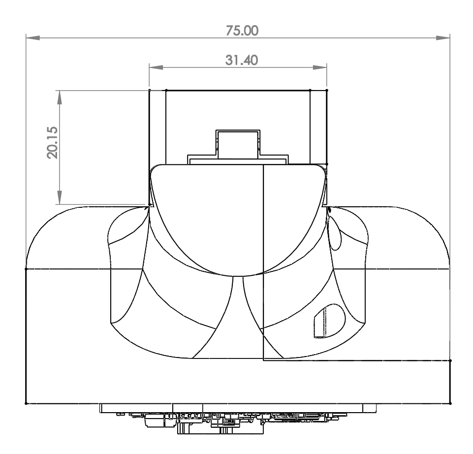
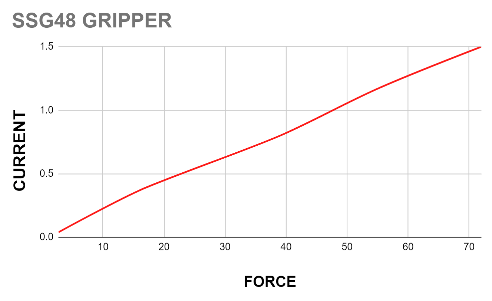

# About the gripper

    
  

SSG-48 adaptive electric gripper is a gripper based on **Spectral micro BLDC drivers**. It is a gripper capable of controlling its gripping force, making it perfect for assembly tasks and human-robot collaboration. Gripping force can be adjusted allowing you to grasp a wide range of items; from delicate and soft to rigid and sturdy.  

STL files are **open source** allowing you to add a custom griping tool and attach it to any robotic arm or robot. 

SSG-48 adaptive electric gripper is available as a fully assembled gripper or you can build your own by following assembly manual.

The gripper has a single actuator for opening  both of its jaws. A system works like rack and pinion where motor is a pinion and jaws are on rack.

If you plan to build SSG-48 adaptive electric gripper by yourself you will need to source all the parts from [this BOM](https://github.com/PCrnjak/SSG-48-adaptive-electric-gripper/tree/main/BOM). 
After that you can follow the [assembly manual](https://github.com/PCrnjak/SSG-48-adaptive-electric-gripper/tree/main/Assembly%20manual) to assemble your gripper.

## **General specs:**

* Power supply: 24V
* Idle power: 0.5W
* Weight: 400 g
* Maximum gripping force: 80N
* Minimum gripping force: 5N
* Operating temperature -5 to 65 deg
* Communication interface: CAN bus
* CAN baud rate: 1Mbit
* Material: PETG plastic
* Stroke: 0 - 48 mm

## **Gripper stroke**

    
 

## **Grasps**

Gripper can perform 2 types of graps:

* External grasp - 
* Internal grasp - allows you to grasp hollow objects

## **Pinout and connection**

    
 

The gripper is powered and controlled with single cable that carries CAN bus communication and 24V power supply.

!!! Tip annotate "Voltages" 
    To power the gripper you need to use 24V.  
    You can send commands to the gripper using **5V** CAN bus. 

## **Dimensions**

    
 | 

    
 

    
 

## **Dimensions with PAROL6 adapter**

    
 

## **3D model**

[Link to the STEP model](https://github.com/PCrnjak/SSG-48-adaptive-electric-gripper/tree/main/STEPS)

    
 

## **Torque curves**

    
 

As you can see from the plot relationship between current and applied force is linear.  Unit of current is Ampere [A] and unit of Force is Newton [N].

!!! Note annotate "Torque curve" 
    Note that this plot only applies to the grippers bought from source robotics that use BLDC motors with fine tuned Kt of 0.325. If you are building your own gripper this value might be different.

## **CAN bus termination**

!!! Tip annotate "**By default SSG48 gripper has terminated can bus with 120 ohm resistor!**" 

## **Spectral driver config**

!!! Note annotate "Config" 
    If you bought the gripper it comes preconfigured and calibrated!

If you are building the gripper you will need to send the following command to it over serial to place the BLDC controller in the gripper mode: 

    #Gripper 1
    #Save