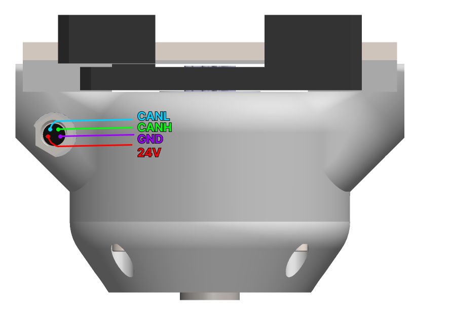

# About the gripper

    
  

SSG-48 adaptive electric gripper is a gripper based on **Spectral micro BLDC drivers**. It is a gripper capable of controlling its gripping force, making it perfect for assembly tasks and human-robot collaboration. Gripping force can be adjusted allowing you to grasp a wide range of items; from delicate and soft to rigid and sturdy.  

STL files are open source allowing you to add a custom griping tool and attach it to any robotic arm or robot. 

SSG-48 adaptive electric gripper is available as a fully assembled gripper or you can build your own by following assembly manual.

If you plan to build SSG-48 adaptive electric gripper by yourself you will need to source all the parts from [this BOM]().
After that you can follow the [assembly manual]() to assemble your gripper.

General specs:

* Power supply: 24V
* Idle power: 0.5W
* Weight: 400 g
* Maximum gripping force: 20N
* Minimum gripping force: 1N
* Operating temperature -5 to 65 deg
* Communication interface: CAN bus
* Material: PETG plastic
* Stroke: 0 - 48 mm

    
 

## Pinout

    
 

To power the gripper you need to use 24V.  
You can send commands to the gripper using 5V CAN bus.  
Check control page and learn how the gripper works.  
Check CAN protocol page if you wish to use gripper API.

## Dimensions
   |   |   |
    ---- | ---- 
    
    
 | 
    
 
    

    
 

### Dimensions with PAROL6 adapter

    
 

## 3D model

[Link to the STEP model]()

    
 

## Torque curves

## Spectral driver config

Upload preconfigured BIN file. Re calibrate the motor after that. TODO 
Using serial interface (On how to use it check this link) (What adapter to get check this link) 
You will need send these commands: 
#Gripper 1