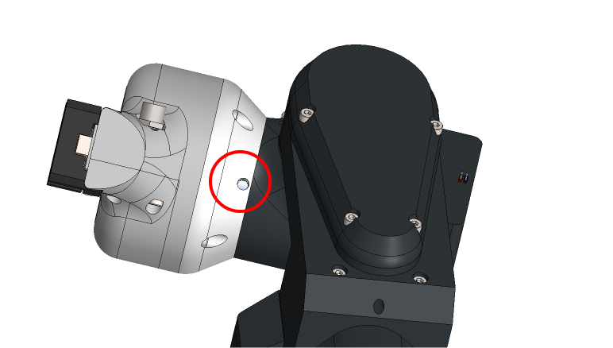

# **Installation**

!!! Note annotate "" 

## **Coupler connector plate**

SSG-48 allows you to adapt it to any robotic arm by 3D printing custom adapters.

You can download [Coupler connector template STEP file]() here and adapt its design to fit your robot or application.

    
 

!!! Note annotate "" 

## **PAROL6 installation**

To use SSG48 gripper with PAROL6 robotic arm you will have to download coupler connector for PAROL6.

=== "Installation"

    Step 1 | Step 2 
    ---- | ---- 
    Attach gripper to J6 motor  | Tighten up the screws of the shaf coupler (Marked with red circle, one on each side)
    
    
  | 
    

!!! Note annotate "" 

## **Electrical setup**

!!! Danger annotate "If you are making DIY cables make sure your cable has the correct pinout. If it does not you will destroy your gripper" 

You can buy suitable cables [here!](https://source-robotics.com/products/gripper-cable)

Connect one end of the cable to the gripper and another to the parol6 gripper connector

!!! Note annotate "" 

## **Jaw adapter template**

You can download [jaw template STEP file]() here and adapt your gripper jaws to your specifications.

    
 

When designing new fingertips for the jaws follow these tips:

* Do not make fingertips with height larger than 80 mm
* Do not make fingertips width larger than 60 mm