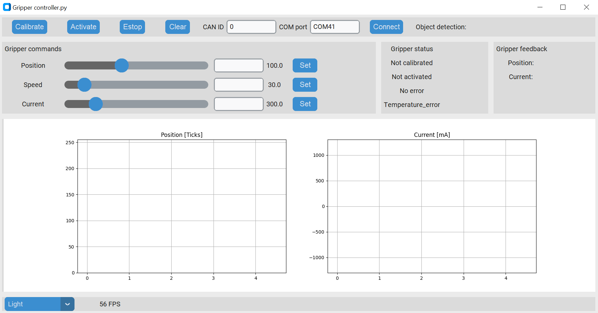

# Control

# Using GUI

<p align="left">  <br /> </p> 

You can install GUI from [here!](https://github.com/PCrnjak/SSG-gripper-GUI)


# Using python API

Since the SSG48 gripper is based on [spectral micro BLDC drivers](https://github.com/PCrnjak/Spectral-Micro-BLDC-controller), it inherits all of their control methods and functionality.
Here we will describe only ones that are needed for gripper operation. For full list of commands go [Here](https://source-robotics.github.io/Spectral-BLDC-docs/apage7_can/).

This example will calibrate the gripper after that it will open and close it. Note if the gripper is in error state you will have to first clear the error!

``` py 
import Spectral_BLDC as Spectral
import time

Communication1 = Spectral.CanCommunication(bustype='slcan', channel='COM41', bitrate=1000000)
Motor1 = Spectral.SpectralCAN(node_id=0, communication=Communication1)

var = 0

while True:


    #Motor1.Send_gripper_data_pack(0,255,1500,1,1,0,0) 
    #Motor1.Send_gripper_data_pack(255,255,1500,1,1,0,0) 

    if var == 0:
        #Motor1.Send_Clear_Error()
        Motor1.Send_gripper_calibrate()
        var = 1
    elif var == 1:
        Motor1.Send_gripper_data_pack(100,20,500,1,1,0,0) 
        var = 2
    elif var == 2:
        Motor1.Send_gripper_data_pack(10,20,500,1,1,0,0) 
        var = 0


    message, UnpackedMessageID = Communication1.receive_can_messages(timeout=0.2) 

    if message is not None:
        print(f"Message is: {message}")
        print(f"Node ID is : {UnpackedMessageID.node_id}")
        print(f"Message ID is: {UnpackedMessageID.command_id}")
        print(f"Error bit is: {UnpackedMessageID.error_bit}")
        print(f"Message length is: {message.dlc}")
        print(f"Is is remote frame: {message.is_remote_frame}")
        print(f"Timestamp is: {message.timestamp}")

        Motor1.UnpackData(message,UnpackedMessageID)
    else:
        print("No message after timeout period!")
    print("")
    time.sleep(4)

```


# Using UART

TODO how to use examples


# Using PAROL6 commander software

TODO how to use examples


