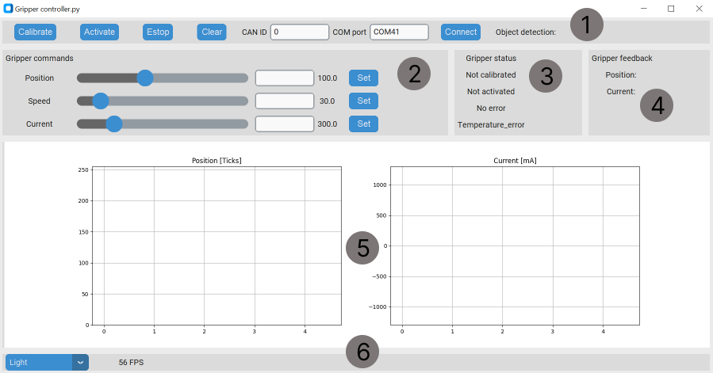

# Control


Primary control interface for SSG48 gripper is **CAN bus**. Secondary control mode is with **UART**. 

!!! Tip annotate "" 
    The gripper can:

    * Control the force, speed and position of gripper jaws
    * Movements of the both jaws are always in sync
    * Movement is initiated with a "Send_gripper_data_pack" command
    * Gripper has built in object detection feature that will report back when a object is detected

!!! Danger annotate "** Go to Application interfaces tab for more details about the gripper commands!**" 


!!! Note annotate "" 

## **Working principle**

* After every power up the gripper needs to be calibrated to function. 
* Calling the calibration command will start the gripper movement.
* After calibration the gripper needs to be activated.
* After activation, gripper can be used (If there are any errors they need to be cleared also)
* Now you can issues "Send_gripper_data_pack" commands that will move the gripper to the specified position with desired speed and torque presets.

The gripper will never send CAN commands on its own. Gripper will only respod to "Send_gripper_data_pack" with "Respond_Gripper_data_pack".

!!! Note annotate "Empty commands" 
    Note that Send_gripper_data_pack can be an empty command containg no data. The gripper will still respond to that with Respond_Gripper_data_pack. This options works great if you have a lot of devices on the can bus of the gripper and dont want to overload it with big data packets. The workflow here would be to send one Send_gripper_data_pack that contains the needed move and after that call Send_gripper_data_pack with no data to get responses from the gripper.

!!! Tip annotate "Command rate" 
    It is recommended to send commands to the gripper with rate of 50Hz or higher!


!!! Note annotate "" 

## **Gripper GUI**


You can install GUI from [here!](https://github.com/PCrnjak/SSG-gripper-GUI) <br /> 
To connect to gripper GUI you will have to have [CAN bus adapter for PC]().   <br /> </p> 


<p align="left">  <br /></p>

* **Section 1** has a few commands important to operation of the gripper and connecting to it. 
* **Section 2** has slider and entry boxes for commanding the gripper
* **Section 3** has shows gripper status
* **Section 4** shows current gripper position and current
* **Section 5** shows live plots of gripper position and current
* **Section 6** shows FPS of the GUI and options for dark/light mode

!!! Note annotate "Note" 
    Only one gripper can be connected to the GUI at the time.

### **Using the GUI**

First you will need to know the COM port where your USB to CAN adapter is connected. After that enter it to the COM port box in section one. 
**Press connect.**
!!! Note annotate "Default CAN Node ID"
    **Default CAN Node ID is 0.**

After you have connected to the GUI you will need to **calibrate the gripper**. Press the calibrate button in the section one. The gripper will start to move and if calibration was success you will see "**Calibrated**" in section 3.    

Now that the gripper is calibrated press **activate button** and in case there is an error active press **clear error** button.

Now you can control your gripper by setting position, speed and current values in section 2. 

!!! Tip annotate "Movement"
    Only setting the position value will start the gripper movement.

In the section 5 you will see live values of gripper position and current.

!!! Note annotate "" 

## **Using python API**

This example will calibrate the gripper; after that it will open and close it. Note if the gripper is in error state you will have to first clear the error!  <br />
Get the API [here!](https://github.com/PCrnjak/Spectral-BLDC-Python/tree/main)

``` py 
import Spectral_BLDC as Spectral
import time

Communication1 = Spectral.CanCommunication(bustype='slcan', channel='COM41', bitrate=1000000)
Motor1 = Spectral.SpectralCAN(node_id=0, communication=Communication1)

var = 0

while True:


    #Motor1.Send_gripper_data_pack(0,255,1500,1,1,0,0) 
    #Motor1.Send_gripper_data_pack(255,255,1500,1,1,0,0) 

    if var == 0:
        #Motor1.Send_Clear_Error()
        Motor1.Send_gripper_calibrate()
        var = 1
    elif var == 1:
        Motor1.Send_gripper_data_pack(100,20,500,1,1,0,0) 
        var = 2
    elif var == 2:
        Motor1.Send_gripper_data_pack(10,20,500,1,1,0,0) 
        var = 0


    message, UnpackedMessageID = Communication1.receive_can_messages(timeout=0.2) 

    if message is not None:
        print(f"Message is: {message}")
        print(f"Node ID is : {UnpackedMessageID.node_id}")
        print(f"Message ID is: {UnpackedMessageID.command_id}")
        print(f"Error bit is: {UnpackedMessageID.error_bit}")
        print(f"Message length is: {message.dlc}")
        print(f"Is is remote frame: {message.is_remote_frame}")
        print(f"Timestamp is: {message.timestamp}")

        Motor1.UnpackData(message,UnpackedMessageID)
    else:
        print("No message after timeout period!")
    print("")
    time.sleep(4)

```


!!! Note annotate "" 

## **Using UART**

To use uart you will have to acces UART port on the SSG48 gripper. Unscrew coupler connector and connect uart adapter to the connector on the image. Note that it uses 3v3, using 5V can destroy your driver/gripper.
To read mode about how to use UART with SSG48/Spectral micro BLDC go to this [link!](https://source-robotics.github.io/Spectral-BLDC-docs/apage6_uart/)

Setup:

* Gripper 1 (Tells our motor controller we are using it as gripper)
* Gripcal (this will calibrate the gripper)

Control:

* Gripvel x (x is value from 0 - 255; 0 being min speed 255 max speed)
* Gripcur x (x is value from 0 - 1300 [mA])
* Grippos x (x is vale from 0 - 255; 0 being fully open 255 fully closed)

!!! Note annotate "Note" 
    **Only Grippos will start the gripper movement!**


!!! Note annotate "" 


