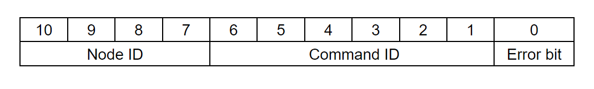

# **Application interfaces**

Since the SSG48 gripper is based on [spectral micro BLDC drivers](https://github.com/PCrnjak/Spectral-Micro-BLDC-controller), it inherits all of their control methods and functionality.  
Here we will describe only ones that are needed for gripper operation. For full list of commands go [Here](https://source-robotics.github.io/Spectral-BLDC-docs/apage7_can/).  
Also since the gripper is based on Spectral micro it has UART interface you can control it with.

    

Bits **10 - 7** of CAN ID represent Node ID.  
Node IDs can range from 0 - 15 Meaning you can have maximum 16 different devices on one CAN bus. 

!!! Note annotate "Default NODE ID" 
    Default NODE ID of the gripper is 0! To change it check the spectral micro docs.

Bits **6 - 1** of the CAN ID represent Command ID. 
Command IDs can range from 0 - 63.

Bit **0** represents error bit. If spectral micro BLDC controller has any active error this bit will be set to 1. Note this bit is send always by the driver and is independent about the command ID and data.

Node with smallest Node ID is strongest in CAN bus arbitration.

## **CAN commands**

### **Respond_Gripper_data_pack**

!!! Note annotate "" 

* Command ID: 60  
* Direction: Gripper -> host  
* Python call: None, this command is sent only by driver  
* Length: 4 byte  
* Type of frame: standard  

Size (bytes) | Variable (Spectral_BLDC Lib python attribute)  | Type | Details
---- | ---- | ---- | ----
0  | gripper_position | unsigned 8bit |
1-2 | gripper_current |  16 bit signed |
3(bit 0) | gripper_activated | bit (0/1) | gripper activated (1) / deactivated (0)
3(bit 1) | gripper_action_status | bit (0/1) |  1 is goto, 0 is idle or performing auto release or in calibration
3(bit 2 and 3) | gripper_object_detection | 2 bit | 0 in motion, 1 object detected closing, 2 object detected opening, 3 at positon
3(bit 4) | gripper_temperature_error | bit (0/1) | gripper_temperature_error
3(bit 5) | gripper_timeout_error | bit (0/1) | gripper_timeout_error
3(bit 6) | gripper_estop_error | bit (0/1) | gripper_estop_error
3(bit 7) | gripper_calibrated | bit (0/1) | gripper calibration status; calibrated (1) / not calibrated (0)

---

---

### **Send_gripper_data_pack**

!!! Note annotate "" 

* Command ID: 61  
* Direction: Host -> Gripper  
* Python API reference: Send_gripper_data_pack()  
* Type of frame: standard  
* Length: 5 byte 

Size (bytes) | Variable | Type | Details
---- | ---- | ---- | ----
0  | Position | unsigned 8bit |
1 | Velocity | unsigned 8bit |
2-3 | Current | signed 16bit |
4(bit 0)  | Gripper activate |  bit (0/1) | 0 - deactivate the gripper, 1 - activate the gripper
4(bit 1)  | Gripper action status |  bit (0/1) | 0 - idle , 1 - movement
4(bit 2)  | Gripper estop status |  bit (0/1) | 0 - No estop, 1 - Estop pressed
4(bit 3)  | Gripper release direction |  bit (0/1) | Not used

Driver will respond to this command with: 
**Respond_Gripper_data_pack**

Alternatively you can send empty Send_gripper_data_pack command

* Command ID: 61  
* Direction: Host -> Gripper  
* Python API reference: Send_gripper_data_pack()  
* Type of frame: standard  
* Length: 0 byte 

Driver will respons to this command with: 
**Respond_Gripper_data_pack**

---

### **Send_gripper_calibrate**

!!! Note annotate "" 

* Command ID: 62  
* Direction: Host -> Gripper  
* Python API reference: Send_gripper_calibrate()  
* Type of frame: standard  
* Length: 0 byte 

**Driver will not respond to this command!** 

---

---

### **Send_CAN_ID**

!!! Note annotate "" 

This command will set a new CAN ID for your motor driver.  
Note that ID you send is the new motor ID.

* Command ID: 11  
* Direction: Host -> Gripper  
* Python API reference: Send_CAN_ID()  
* Type of frame: standard  
* Length: 1 byte 

Size (bytes) | Variable | Type 
---- | ---- | ----
0 | ID | byte

**Driver will not respond to this command!** 

---

### **Send_Save_config**

!!! Note annotate "" 

* Command ID: 13  
* Direction: Host -> Gripper  
* Python API reference: Send_Save_config()  
* Type of frame: standard  
* Length: 0 byte 

**Driver will not respond to this command!** 

---

### **Send_Reset**

!!! Note annotate "" 

* Command ID: 14  
* Direction: Host -> Gripper  
* Python API reference: Send_Reset()  
* Type of frame: standard  
* Length: 0 byte 

**Driver will not respond to this command!** 

---

### **Send_Clear_Error**

!!! Note annotate "" 

* Command ID: 1  
* Direction: Host -> Gripper  
* Python API reference: Send_Clear_Error()  
* Type of frame: standard  
* Length: 0 byte 

**Driver will not respond to this command!** 

---

## **UART interface**

For full list of UART commands available to the SSG48 gripper check this [link!](https://source-robotics.github.io/Spectral-BLDC-docs/apage6_uart/)

### **Gripper commands**
Commands used when in gripper mode. Procedure: 

* Gripper 1 (Tells our motor controller we are using it as gripper)
* Gripcal (this will calibrate the gripper)
* Gripvel x (x is value from 0 - 255; 0 being min speed 255 max speed)
* Gripcur x (x is value from 0 - 1000 [mA])
* Grippos x (x is vale from 0 - 255; 0 being fully open 255 fully closed)

 Name | Type | Input Data type | Desciption | Response
---- | ---- | ---- | ---- | ----
`Gripper` | Set/Get | bool | `Set/get Am I a gripper` | Is this device gripper or not
`Gripcal` | Action |  | `Start gripper calibration` |   None
`Grippos` | Set/Get | uint8_t | `Set/get desired gripper setpoint position (from 0 to 255). Also will set gripper into GOTO mode and execute the command` | Gripper positon value
`Gripvel` | Set/Get | uint8_t | `Set/get desired gripper velocity setpoint (from 0 to 255)` | Gripper velocity value setpoint
`Gripcur` | Set/Get | int | `Set/get desired gripper current in mA from 0 - 1000 (Note value below 150 are unstable)` | Gripper current value setpoint; to get current current value use #Iq
`Gripact` | Set/Get | bool | `Set/get gripper activation bit` | Is gripper activated or not
`Gripstop` | Set/Get | bool | `Set/get gripper Estop bit` | Gripper estop bit status
`Gripinfo` | Action |  | `Print information about this gripper` | All information about gripper like: is it calibrated, status, endstop values...